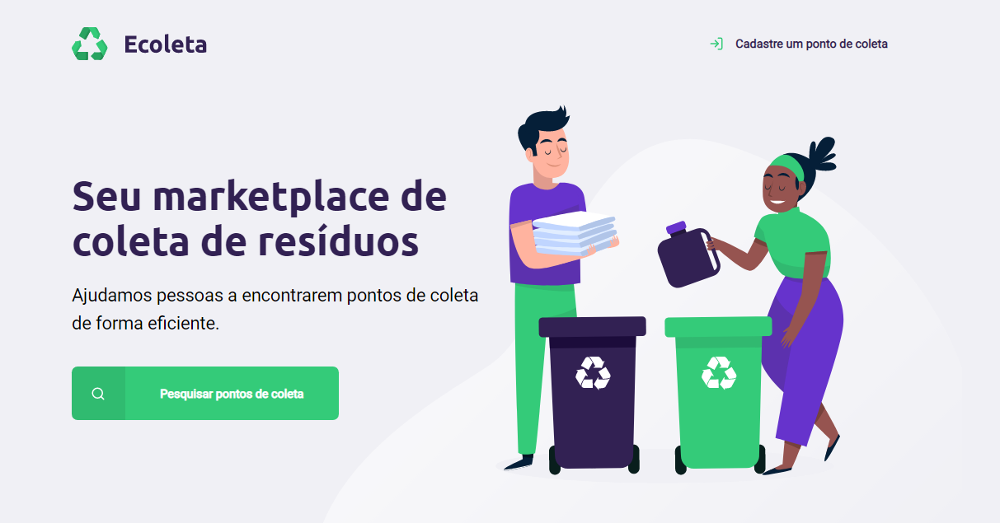
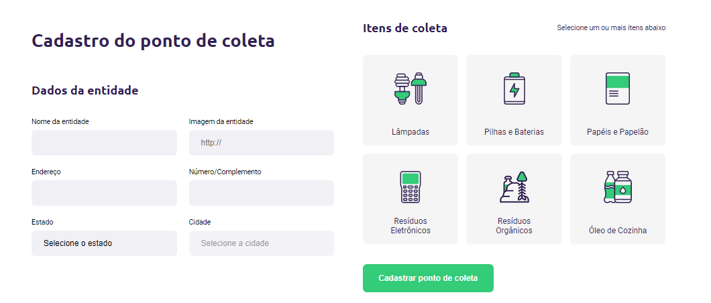
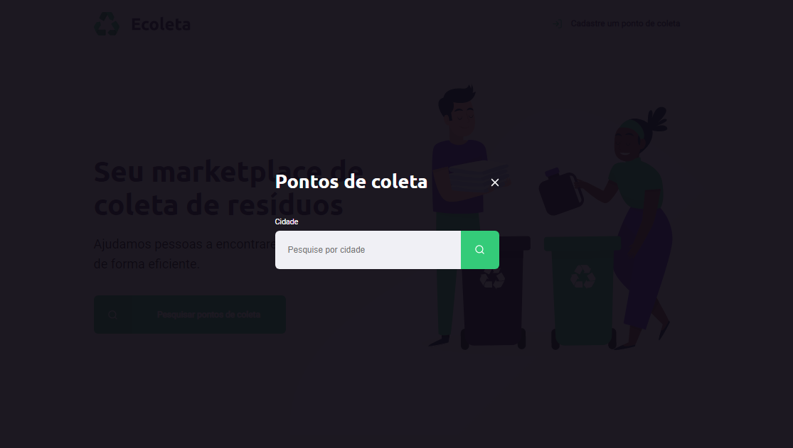
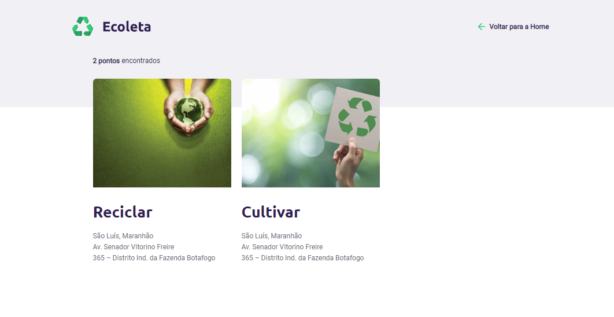

<h1 align="center">
    
</h1>

<h4 align="center"> 
	NextLevelWeek 1.0 🚀
</h4>

  

  	
  

  
	
  
  

  
   

## ♻️ Sobre o projeto

Ecoleta é uma plataforma Marketplace para conectar empresas e entidades de coleta de resíduos orgânicos e inorgânicos as pessoas que precisam descartar seus resíduos de maneira ecológica.

As empresas ou entidades poderão se cadastrar na plataforma web enviando:
- Imagem do ponto de coleta;
- Nome da entidade;
- Endereço e complemento;
- Selecionar um ou mais ítens de coleta: 
  - lâmpadas
  - pilhas e baterias
  - papéis e papelão
  - resíduos eletrônicos
  - resíduos orgânicos
  - óleo de cozinha

O projeto foi desenvolvido durante a **NLW - Next Level Week** oferecida pela [Rocketseat](rs). A **NLW** é uma experiência prática, online e gratuita com muito conteúdo prático, desafios e hacks onde o conteúdo fica disponível durante uma semana para que os alunos possam desenvolver o seu projeto final com a ajuda dos instrutores.

## 🛠 Layout

### 💻 Home Page and Form page

  

  

### 📝 Search points and Results

  

  

## 📝 Licença

Este projeto esta sobe a licença GPL. Veja a [LICENÇA](license) para saber mais.

Para maiores informações, entre em contato comigo pelo 🧑💼 [Linkedin](https://www.linkedin.com/in/jackson10/) ou [Twitter](https://twitter.com/jjacksoon1)

Ah! sigam meu perfil aqui no Github! 🐱

[license]: https://github.com/jjacksoon/NLW/blob/master/LICENSE
[rs]: https://rocketseat.com.br